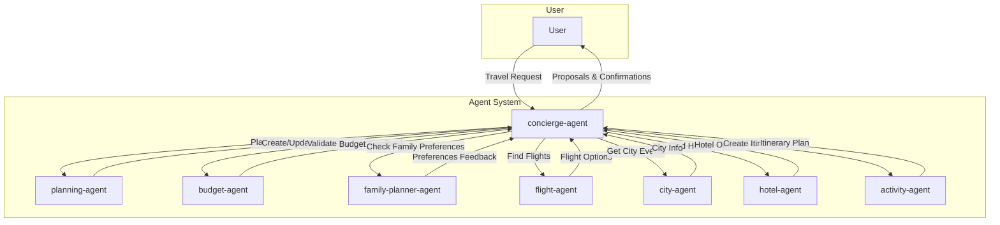

# Real-world Family Travel Agent

This project implements a multi-agent system for planning family trips. A main "Concierge" agent orchestrates several specialized sub-agents to create a comprehensive travel plan based on user preferences.

## Tech Stack

- **Agents:** Google ADK v1.0+
- **Agent Communication:** A2A (Agent-to-Agent) protocol
- **Real-world Data:**
    - Airbnb MCP server
    - SERPER APIs for flights and hotels (via a custom Ruby MCP server)
    - `context7` MCP for coding assistance

## Agent Architecture

The system is composed of a main "concierge-agent" that delegates tasks to specialized sub-agents.



## User Workflow

1.  The user initiates a travel request with details like destination, dates, and preferences.
2.  The **concierge-agent** receives the request and starts the planning process.
3.  The **flight-agent** is tasked to find suitable flights. The user is presented with options and confirms a choice.
4.  With the dates locked in, the **hotel-agent** searches for accommodation. It presents the user with a ranked list of options, including a map view, for confirmation. The agent can perform additional checks based on user feedback (e.g., verifying amenities from reviews).
5.  Once flights and hotels are confirmed, the **activity-agent** creates a detailed itinerary, considering user preferences, travel times, and local conditions.
6.  The **budget-agent** and **family-planner-agent** continuously validate the plan against the user's budget and preferences.
7.  The **city-agent** provides information about local events that might impact the trip.
8.  The user interacts with the concierge-agent to refine and approve the plan at various stages.
9.  The final, approved plan is delivered to the user in a structured format, including a synopsis, a checklist of TODOs, a detailed itinerary, a map, and a cost breakdown.

## 📁 Project Structure

```
.
├── GEMINI.md
├── PRD.md
├── README.md
├── doc/
├── src/
│   ├── agents/
│   │   ├── planning-agent/
│   │   ├── budget-agent/
│   │   ├── family-planner-agent/
│   │   ├── flight-agent/
│   │   ├── city-agent/
│   │   ├── hotel-agent/
│   │   └── activity-agent/
│   ├── app-v1/
│   └── app-v2/
└── iac/
```