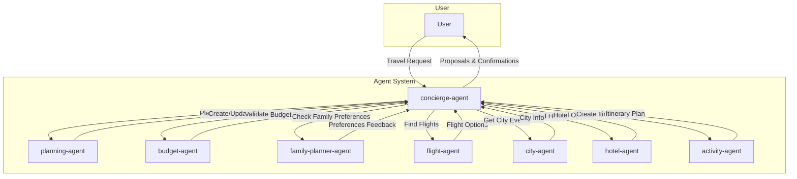

# Real-world Family Travel Agent

This project implements a multi-agent system for planning family trips. A main "concierge-agent" orchestrates several specialized sub-agents to create a comprehensive travel plan based on user preferences.

For a detailed breakdown of the project's requirements, please see the [Product Requirements Document](PRD.md).

## Agent Architecture

The system is composed of a main "concierge-agent" that delegates tasks to specialized sub-agents.



## User Workflow

The user interacts with the system by providing a travel request. The concierge-agent then coordinates with the other agents to:

1.  **Find the best flights and hotels:** The `flight-agent` and `hotel-agent` find the best options based on the user's request.
2.  **Create a personalized itinerary:** The `activity-agent` creates a detailed itinerary, while the `family-planner-agent` ensures it aligns with the family's preferences.
3.  **Manage the budget:** The `budget-agent` keeps track of the costs and ensures the trip stays within budget.
4.  **Provide local insights:** The `city-agent` provides information about local events and attractions.

The user is involved in the planning process at every step, providing feedback and making decisions to ensure the final plan is perfect.

## 📁 Project Structure

```
.
├── GEMINI.md
├── PRD.md
├── README.md
├── doc/
├── src/
│   ├── agents/
│   │   ├── planning-agent/
│   │   ├── budget-agent/
│   │   ├── family-planner-agent/
│   │   ├── flight-agent/
│   │   ├── city-agent/
│   │   ├── hotel-agent/
│   │   └── activity-agent/
│   ├── app-v1/
│   └── app-v2/
└── iac/
```
