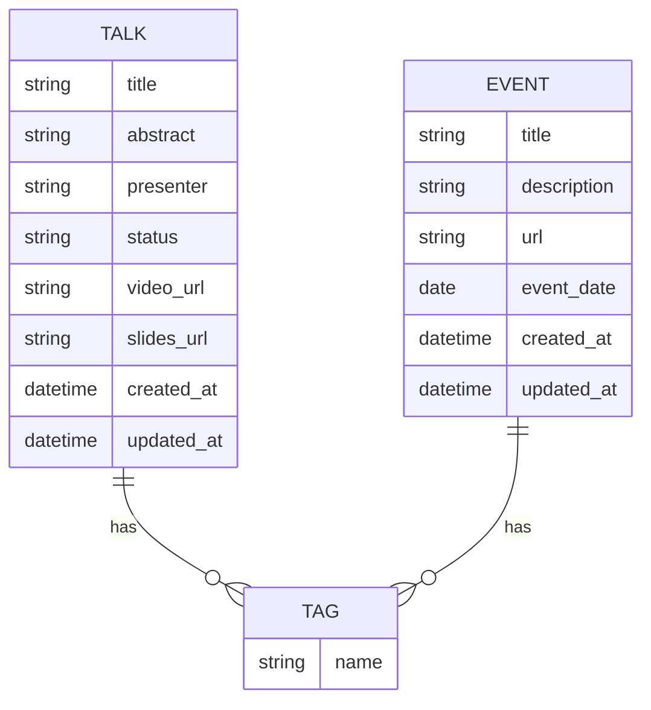

# My Portfolio

This is a portfolio application to showcase my talks and demos.

## DB Schema


```mermaid
erDiagram
    TALK ||--o{ TAG : has
    EVENT ||--o{ TAG : has
    TALK {
        string title
        string abstract
        string presenter
        string status
        string video_url
        string slides_url
        datetime created_at
        datetime updated_at
    }
    EVENT {
        string title
        string description
        string url
        date event_date
        datetime created_at
        datetime updated_at
    }
    TAG {
        string name
    }
```

## Development

To get started, run:

```bash
npm install
npm run dev
```
