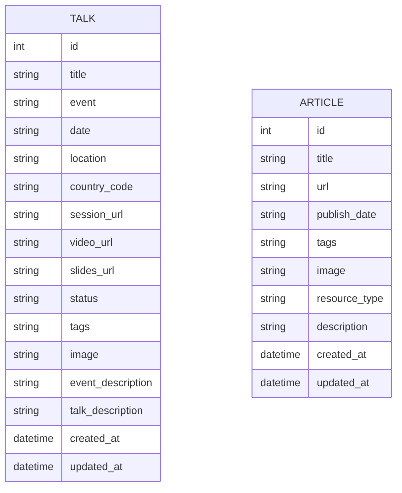
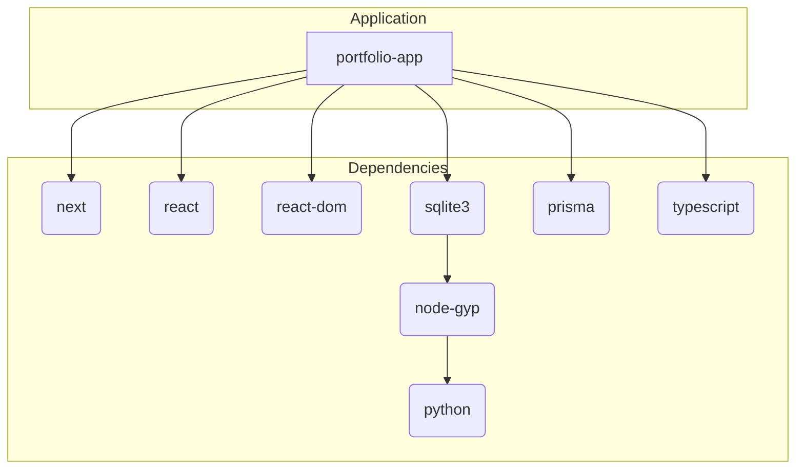

# My Portfolio

This is a portfolio application to showcase my talks and demos.

App is live publicly here: https://portfolio-app-272932496670.europe-west1.run.app/ (DEV)

I'm currently also building [PROD](https://portfolio-app-prod-272932496670.europe-west1.run.app/). But they're both
affected by `BUG-02.md`. So working on dev first.

Alternative views:

* https://linktr.ee/palladius
* https://github.com/palladius/my-sessions-and-bio

## Installation

1.  **Install Dependencies:**
    ```bash
    npm install
    ```
    > **Note:** The `sqlite3` package requires Python to be installed on your system to compile native extensions. If you encounter errors during `npm install`, please make sure you have a recent version of Python installed.

2.  **Set up Environment:**
    Copy the `.env.dist` file to `.env` and fill in your Google Cloud project ID and region.
3.  **Initialize Google Cloud:**
    Run the following script to enable the necessary Google Cloud APIs:
    ```bash
    ./bin/gcp-init.sh
    ```
4.  **Connect GitHub Repository:**
    Before applying the Terraform configuration, you need to connect your GitHub repository to Google Cloud Build.
    *   Go to the [Cloud Build triggers page](https://console.cloud.google.com/cloud-build/triggers) in the Google Cloud Console.
    *   Click **Connect repository**.
    *   Select **GitHub** as the source.
    *   Follow the on-screen instructions to authorize Google Cloud Build to access your GitHub account and select your repository.

## DB Schema



## Development

To get started, run:

```bash
npm install
npm run dev
```

## Deployment

This application is set up for continuous deployment with Google Cloud Build and Cloud Run. See the `cloudbuild.yaml` file for details. The Terraform configuration in the `iac` directory will set up the necessary infrastructure.

## Dependency Graph



## A Note on Environment Variables in Next.js

A critical concept for this application is how Next.js handles environment variables, particularly those prefixed with `NEXT_PUBLIC_`.

### Build Time vs. Run Time

1.  **Build Time (`next build`):** When the application is built, Next.js performs a "search and replace" for any `process.env.NEXT_PUBLIC_` variables. It finds their value *at that moment* and bakes the literal string value into the final JavaScript files that are sent to the browser.

2.  **Run Time (`next start`):** When the application is running on a server, the JavaScript files sent to the browser already have the URL hardcoded in them. Changing the environment variable on the server at this point has no effect on the already-built frontend code.

### The Solution: Relative URLs & Direct Database Access

To ensure our application works in any environment (local, dev, prod) with a single Docker image, we use the following strategy:

1.  **For Client-Side Code (in the browser):** We use relative URLs (e.g., `fetch('/api/talks')`). The browser automatically knows to make the request to the same domain that is currently hosting the page.

2.  **For Server-Side Code (on the server):** A server component should not `fetch` its own API, as this is an inefficient network hop. Instead, server-side data fetching functions now bypass `fetch` and call the underlying database logic directly, just as the API routes do.

This approach allows us to use a **single, universal Docker image** that works in any environment without changes, simplifying our entire build and deployment process.
