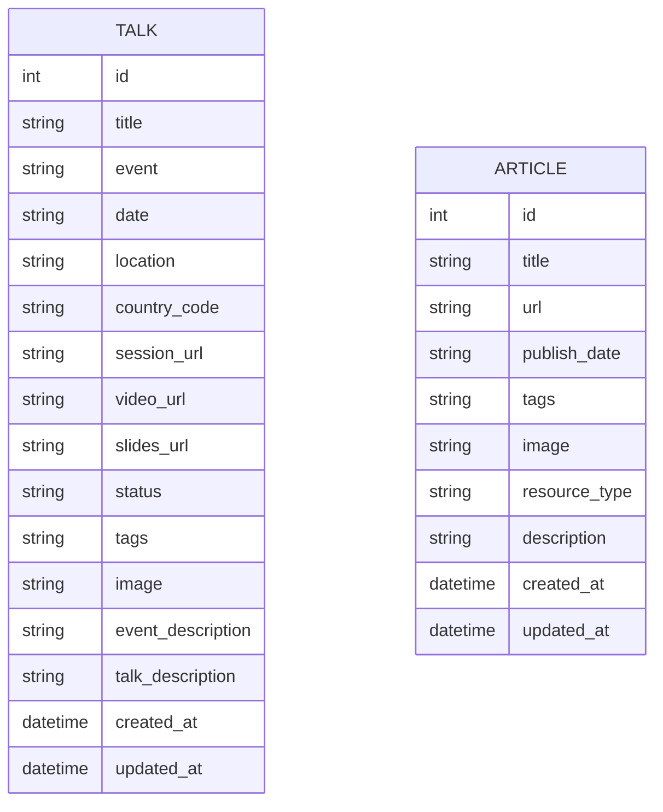

# My Portfolio

This is a portfolio application to showcase my talks and demos.

## Installation

1.  **Install Dependencies:**
    ```bash
    npm install
    ```
2.  **Set up Environment:**
    Copy the `.env.dist` file to `.env` and fill in your Google Cloud project ID and region.
3.  **Initialize Google Cloud:**
    Run the following script to enable the necessary Google Cloud APIs:
    ```bash
    ./bin/gcp-init.sh
    ```
4.  **Connect GitHub Repository:**
    Before applying the Terraform configuration, you need to connect your GitHub repository to Google Cloud Build.
    *   Go to the [Cloud Build triggers page](https://console.cloud.google.com/cloud-build/triggers) in the Google Cloud Console.
    *   Click **Connect repository**.
    *   Select **GitHub** as the source.
    *   Follow the on-screen instructions to authorize Google Cloud Build to access your GitHub account and select your repository.

## DB Schema



## Development

To get started, run:

```bash
npm install
npm run dev
```

## Deployment

This application is set up for continuous deployment with Google Cloud Build and Cloud Run. See the `cloudbuild.yaml` file for details. The Terraform configuration in the `iac` directory will set up the necessary infrastructure.
