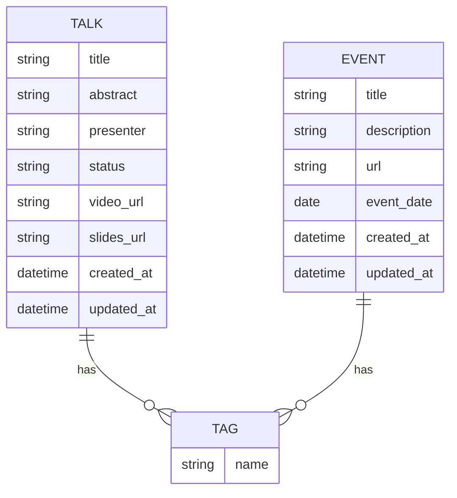

# My Portfolio

This is a portfolio application to showcase my talks and demos.

## DB Schema



## Development

To get started, run:

```bash
npm install
npm run dev
```

## Deployment

This application is set up for continuous deployment with Google Cloud Build and Cloud Run.

### Prerequisites

1.  **Enable APIs:** Make sure the following APIs are enabled in your Google Cloud project:
    *   Cloud Build API
    *   Artifact Registry API
    *   Cloud Run API
2.  **Create Artifact Registry Repository:** Create a Docker repository in Artifact Registry. The `cloudbuild.yaml` is configured to use a repository named `portfolio` in the `europe-west1` region.
3.  **Grant IAM Roles:** The Cloud Build service account needs the following IAM roles:
    *   `Cloud Run Admin` (`roles/run.admin`)
    *   `Artifact Registry Writer` (`roles/artifactregistry.writer`)

### Cloud Build Trigger

To set up automatic deployments on every push to the `main` branch, create a Cloud Build trigger with the following settings:

*   **Name:** A descriptive name for your trigger (e.g., `deploy-on-push`).
*   **Event:** Push to a branch.
*   **Repository:** Your Git repository.
*   **Branch:** `main`.
*   **Build configuration:** Cloud Build configuration file (yaml or json).
*   **Location:** Repository.
*   **Cloud Build configuration file location:** `cloudbuild.yaml`.
