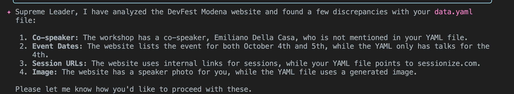
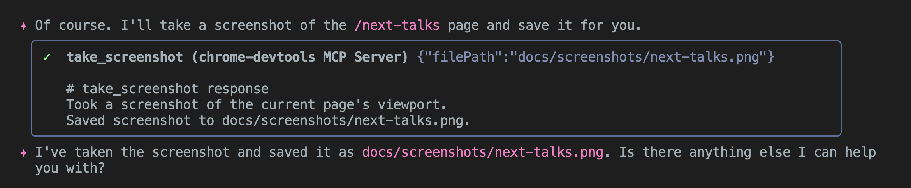
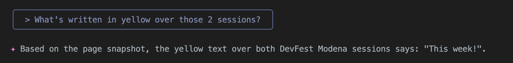

# Demo Modena

## Prep

One one window, run the server:

```bash
just run-dev
```

## 1. Screenshots

```bash
just gemini-take-screenshots-via-playwright
```

## 2. Add/Edit event

On another terminal, you will need this:

```bash
gemini -c -y
```

Prompt:

```
I'm presenting at a *DevFest Modena* event super-soon on "Sat 4 oct"!
* Event details are here: https://devfest.modena.it/
* My sessions are:
  * This morning, this demo/presentation on gemini cLI
  * this afternoon, a workshop on Rails/Gemini CLI/MCP.
* Ensure all the data are there. For any discrepancy, please check with me which of the two info is correct, and let's update the YAML.

Finally, please add this to my Apps Portoflio yaml in etc/ and update the DB.
```

### If necessary, ask to find discrepancies

```
Check on https://devfest.modena.it/ and find discrepancies, if any.
```

Awesome result:



### 2.C Now Same with MCP

```
Now use MCP Chrome DevTools to navigate to the "Next Talks" (/next-talks) and ensure both the keynote and the workshop appear there.
```

```
Take a screenshot of that page with MCP DevTools if possible.
```

and it works!



Let's check now the multimodality too...

```
What's written in yellow over those 2 sessions?
```



Chapeau.

## 3. MCP Chrome DevTools

```markdown

1. Ensure the app is started and is logging to log/ .
2. Use Chrome Dev Tools MCP server to check for client-side JS errors in the main endpoints (/, /talks, /about, ..).
   Also visit a sample talk (/talks/TALK_NAME) and a sample article page. Any errors there?
3. If you find any errors, enumerate them and add context in docs/investigations/chrome-devtool-clientside-errors.md
4. Finally, repeat the same experiement in PROD with the prod url. Is there some bug there?
   Add some h2 "## In production" section with any different findings, if any.
```

