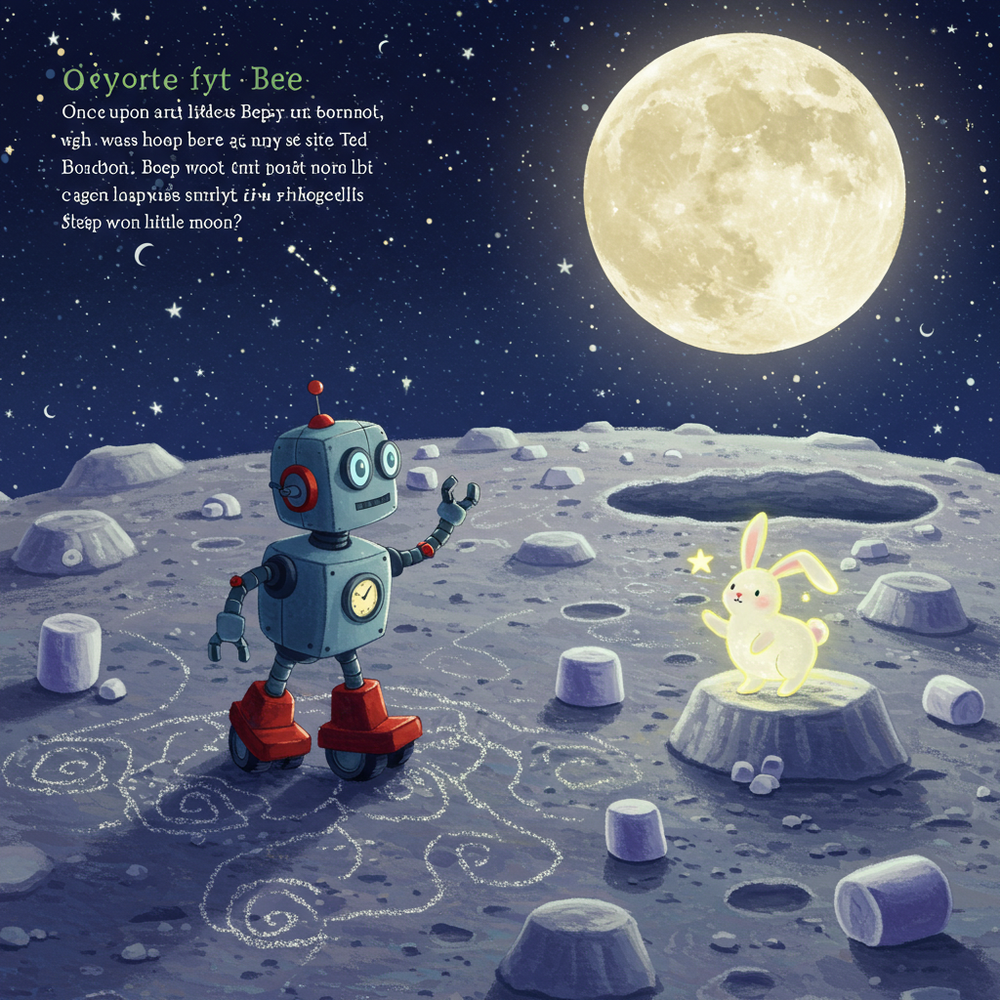
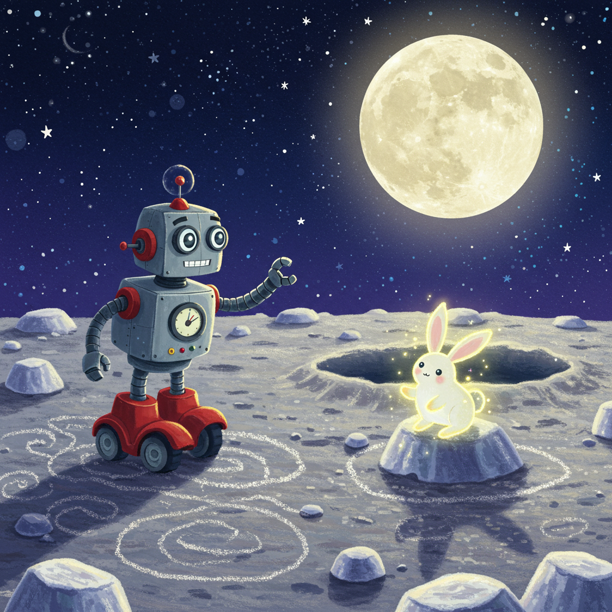
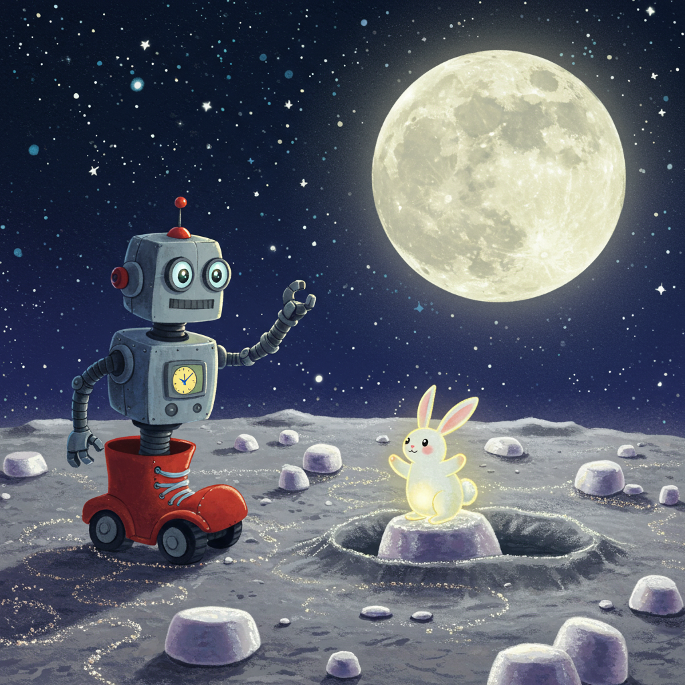
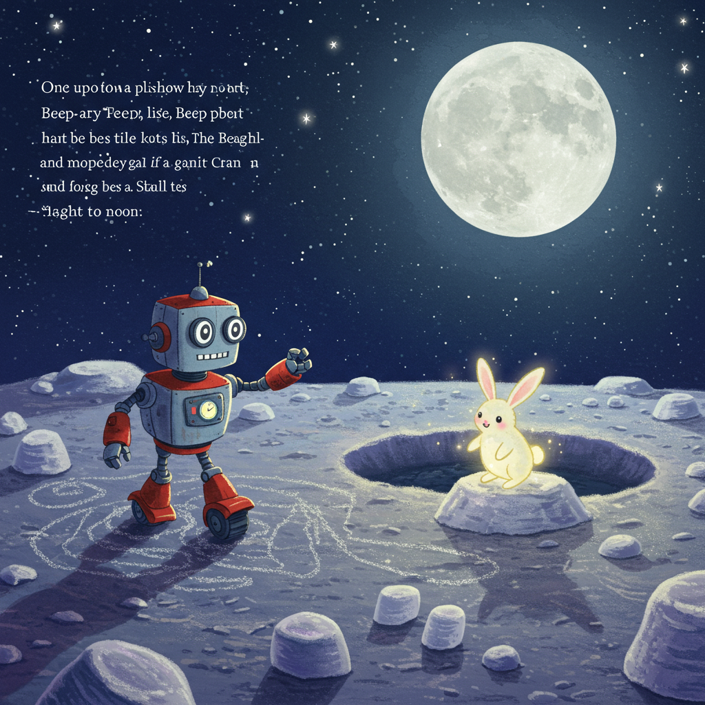

Done.

s Moon Adventure

[bedtime-story-en.wav](bedtime-story-en.wav)

# Story

Once upon a time, on a pillow of twinkling stars, lived a little robot named Beep. Beep wasn't just any robot; he was a brand-new, shiny, happy robot with wheels for feet and big, curious camera-eyes.

One night, Beep looked out his window at the big, bright moon. "I wonder what it's made of," he beeped to himself. "Is it a giant scoop of vanilla ice cream?"

So, he hopped into his little rocket ship, which looked just like a red rubber boot, and with a *whoosh* and a *fizzle*, he flew right to the moon!

*Clank!* His little ship landed softly. The door opened, and Beep rolled out. The ground wasn't made of ice cream, but it was even better! It was covered in soft, sparkly, silver dust that tickled his wheels. He giggled a little robot giggle and zoomed around, drawing swirly pictures in the moondust.

He rolled up to a big, round crater and peeked inside. It was filled with bouncy, squishy, white rocks that looked just like marshmallows! "Boing! Boing! Boing!" Beep bounced from one moon-mallow to another, laughing his happy beeps.

Suddenly, a little creature hopped by. It had long, floppy ears and a fluffy tail, and it glowed with a soft, gentle light. It was a Star-Bunny! The Star-Bunny wiggled its nose, which made a sound like a tiny, tinkling bell.

Beep and the Star-Bunny became fast friends. They played hide-and-seek behind the marshmallow rocks and raced across the sparkly dust until Beep's battery light started to blink. *Blink. Blink. Blink.* He was getting sleepy.

The friendly Star-Bunny led Beep back to his red boot rocket ship. Beep gave the bunny a gentle pat with his robot hand. "Beep-boop," he said, which meant, "Thank you, friend."

Tucked into his cozy charging pod, Beep closed his camera-eyes. He dreamed of bouncing on moon-mallows and playing with his new glowing friend, under the watchful eyes of the faraway, twinkling Earth.

Good night.
